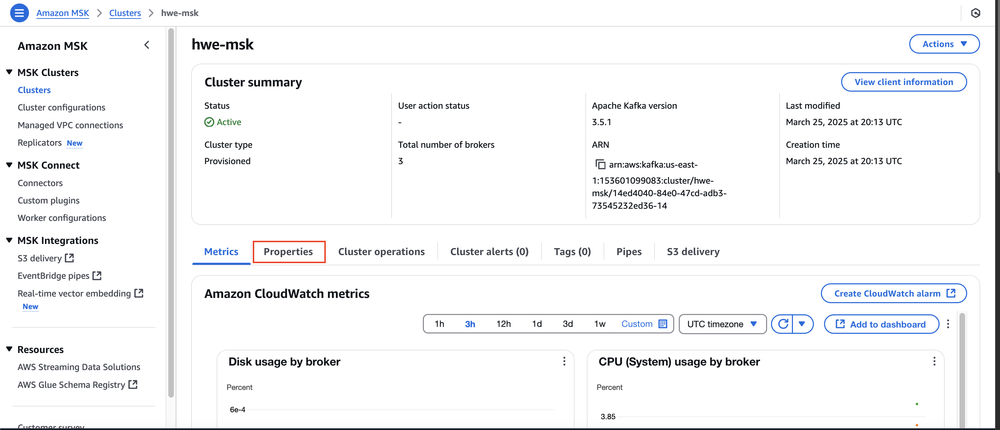
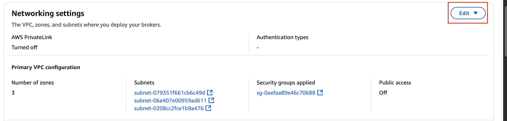
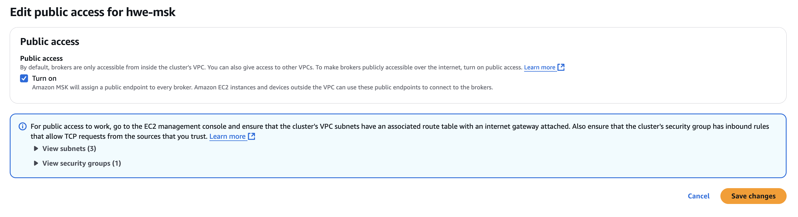

# HWE environment setup

A guide to setting up the AWS environment for Hours With Experts.

## Setting up the Hours With Experts environment

### High level guide
1. Set up prequisites to run Terraform.
2. Run the Terraform process. (This will spin up 90% of the AWS environment.)
3. Set up the IAM users for the students and instructors.
4. Set up the MSK cluster.
5. Enable public access on the MSK cluster. (This is hard to script in Terraform).
6. Write data to the Kafka topics
7. Set up the Superset master node.

### Set up prequisites to run Terraform.
1. Create an S3 bucket named `hwe-terraform-backend` (Terraform can't manage its own backend since it's required to exist before terraform can initialize/run commands.)
2. Make sure you have access to an IAM user with AdministratorAccess to run terraform.

### Run the Terraform process
#### Setting up variables

The `terraform` process uses 3 variables, 2 of which are not sensitive and can be set in `terraform.tfvars`, 1 of which is sensitive and which the process will prompt you for a value at runtime.

##### Not-sensitive variables to set in `terraform.tfvars`:
* `SEMESTER`: a non-senstive string in the form of `season-yyyy`, eg, fall-2024, spring-2025. This can be set in `terraform.tfvars`. Used to name the base S3 bucket for the class.
* `HWE_USERNAME`: a non-sensitive string representing the username for the MSK cluster we will create. This can be set in `terraform.tfvars`

##### Sensitive variables not to set in `terraform.tfvars`:
* `HWE_PASSWORD`: a sensitive string representing the password for the MSK cluster we will create. This should not be set in `terraform.tfvars` to avoid the risk of it being checked in. `terraform` will prompt you for a value at runtime.

#### Running the main Terraform process

Note: All `terraform` commands should be run from the `hwe_aws_env/terraform` directory, and executed as an IAM user with AdministratorAccess.

1. It does not hurt to destroy the existing environment first with `terraform destroy` to make sure you have a clean slate.
2. Edit the `terraform.tfvars` file to make sure non-sensitive variables are set correctly 
3. Run `terraform apply` to re-build the environment. This will create all resources in all `.tf` files inside the `hwe_aws_env/terraform` folder.
* All resources are currently in a large `hwe_all.tf` file.
* It will prompt you for any variables not set in `terraform.tfvars`, some of which are sensitive and should not be includedin source control.

### Set up the IAM users for the students and instructors

Note: These commands should be run from the `hwe_aws_env/setup_users` directory, and executed as an IAM user with AdministratorAccess.

1. Edit `setup_users/students.txt` and `setup_users/instructors.txt` for the new roster.
2. Run `create_iam_users_for_hwe.sh filename 'initialpasswordsuffix'`. This will create a user for each line in the file, with an initial password of `username` concatenated with `initialpasswordsuffix`, and create an individual directory under the base S3 bucket. 
* Put single quotes around the password suffix argument, since you will probably be including a special character.

### Set up the MSK cluster

Once the MSK cluster has been created, there is some further setup to get it ready for use. We will use an edge node to complete this step, since this cluster isn't accessible for public access as created. Once these steps have been completed, the edge node can be stopped/removed.

#### Set up the edge node
Use the script below to:
1. install a Java runtime and the Kafka CLI tools
2. Setup ACLs on the Kafka cluster (a requirement to allow public access)
3. Create our topics ("reviews" and "kafka-connection-test")

All other steps (writing/reading data, etc.) can be accomplished on a personal device, so the edge node only needs to be up for a short time. Once these steps are complete, it can be stopped/removed.

Log into the edge node using the EC2 Instance Connect through the Management Console.

```bash
#Set up ZK variable
export ZK=... #Use the PLAINTEXT/2181 ZK connection string, not the TLS/2182 one
#eg, export ZK=z-3.hwemsk.z94r9v.c20.kafka.us-east-1.amazonaws.com:2181,z-1.hwemsk.z94r9v.c20.kafka.us-east-1.amazonaws.com:2181,z-2.hwemsk.z94r9v.c20.kafka.us-east-1.amazonaws.com:2181
#install Java
sudo dnf install java-11-amazon-corretto-devel -y
#Install kafka CLI tools
wget https://archive.apache.org/dist/kafka/2.6.2/kafka_2.12-2.6.2.tgz
tar -xvf kafka_2.12-2.6.2.tgz
cd kafka_2.12-2.6.2/bin
#Set up Kafka ACLs on the cluster
./kafka-acls.sh --authorizer-properties zookeeper.connect=$ZK --add --allow-principal 'User:*' --operation All --topic '*' --group '*'
#Create topics
./kafka-topics.sh --create --zookeeper $ZK --replication-factor 3 --partitions 1 --topic kafka-connection-test --config retention.ms=31556952000
./kafka-topics.sh --create --zookeeper $ZK --replication-factor 3 --partitions 1 --topic reviews --config retention.ms=31556952000
```

### Enable public access on the MSK cluster.

MSK clusters cannot be created with public access turned on - they must be created as private clusters, then they can be modified to enable public access. After the MSK cluster has been created, an administrator has to enable public access via the console. This is very straightforward using the GUI but does take ~30 minutes to run.

1. Select the MSK cluster from the MSK home page
2. Click on Properties

3. Scroll down to Networking settings, and click "Edit"

4. Turn on Public Access


### Write data to the Kafka topics

#### Setting up the Kafka connection test topic
Run `simple_producer.py`

#### Setting up the Kafka `reviews` topic
Run `file_producer.py`, setting a `limit` if desired (I usually don't)

### Set up the Superset master node.
https://1904labs.atlassian.net/wiki/spaces/DAT/pages/2189000705/Setting+up+a+Superset+server+in+EC2

## Destroying the environment

Terraform can clean up most of the AWS environment, but there are a few things to handle manually...

### Destroying the IAM users for the students and instructors
Note: These commands should be run from the `hwe_aws_env/setup_users` directory, and executed as an IAM user with AdministratorAccess.

Run `delete_iam_users_for_hwe.sh filename` to delete each user in `filename`. This script will also remove the users individual directory under the base S3 bucket.

### Destroying the rest of the AWS environment
Note: All `terraform` commands should be run from the `hwe_aws_env/terraform` directory, and executed as an IAM user with AdministratorAccess.

Running `terraform destroy` will tear down the environment. 

Note: If any users remain in the IAM group terraform manages for the course (`hwe-students`), terraform will be unable to delete it.

### Optional poststeps to deleting environment
If desired, delete the `hwe-terraform-backend` bucket which is not managed by `terraform`. It's also fine to leave it and re-use it next semester.

## Improvements to make to this repo
* Add Athena workgroup information (primary, hwe, superset)
* Split the large `hwe_all.tf` file into smaller components
* Store the MSK zookeeper_connect_string in SSM parameter store
* Create an AMI that has the Java runtime, Kafka CLI, and Amazon review data saved at root. Execute bash commands on that AMI
* Script remaining manual steps, possibly with Ansible:
  * Can Terraform manage the users as well? Could get rid of helper scripts, etc.
  * Can Ansible setup the edge node and use it to configure the MSK cluster, maybe using an AMI? Would need to get ZK connection info into it...
  * Can Terraform enable public access on the MSK cluster? It's one click on the GUI, but I couldn't get it to work via Terraform...
  * Write data to Kafka topics would be great too...

